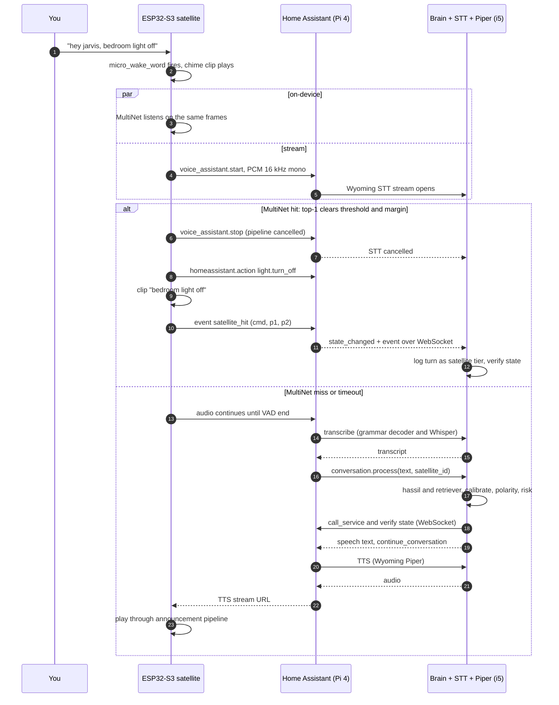

# Jarvis: architecture review and ESP32 satellite design

13 September 2026. This reviews the April 2026 diagram (`jarvis_system_architecture.svg`, v1) against the current design (`jarvis/jarvis-v2.html`, 10 September 2026, v2) and then replaces the satellite with an ESP32-S3.

The settled decisions are taken as given and designed within: fully offline, brain on the i5 8th-gen Proxmox box on CPU only, nothing heavy on the HAOS Pi 4, correctness before capability, and the governing rule that embeddings retrieve and deterministic code decides.


The diagram above is the whole system after this review, drawn in the same form as the April picture it replaces. The SVG source sits next to it as `jarvis_system_architecture_v3.svg`.

---

## 1. What v1 got wrong and what v2 already fixed

v2's defect model is right and this review does not reopen it. The table reconciles every box in the v1 diagram with where it stands now.

| v1 element (from the diagram) | Why it was wrong | Status in v2 |
|---|---|---|
| `FAISS #1 / #2 score > 0.85` fires the action | Cosine cannot see polarity. "turn on X" and "turn off X" sit near 0.94 | Fixed. Retrieval proposes, the guard chain decides |
| Scored router "scores all paths, picks highest" | Raw scores from two indexes are not comparable units | Fixed. One store, isotonic calibration per matcher |
| Rule engine as a fallback below FAISS | The high-precision matcher ran last | Fixed. hassil races at tier 0 |
| Gemma 3:4B "200–400 ms, 85% of fallbacks" | 5–10 s on this CPU. The number was never achievable | Fixed. No generative model. DistilBERT intent + slot classifier |
| Cloud API, Claude Haiku "5% of requests" | Contradicts fully offline | Removed by decision |
| FAISS + SQLite + RAM short-term + episodic store | Four stores that drift | Fixed. SQLite + sqlite-vec is the single truth |
| Home Assistant REST API | Per-call connection, no state stream | Fixed. WebSocket |
| Response layer "parallel TTS + action" | Announce-then-act cannot be parallel | Fixed by tier B ordering |
| Raspberry Pi edge, OpenWakeWord, Whisper on the PC | Every turn pays for STT | Partly. v2 sketches an ESP32-S3 with MultiNet. Section 3 makes it concrete |
| Semantic dedup "similarity > 0.92, merge" | The 0.85 defect again, in the memory layer | Not addressed. See 2.7 |
| Short-term memory "last 10 turns, ~20 tokens" | Only made sense as LLM prompt budget | Moot. v2 keeps last entity + area, which is the useful slice |
| HA custom integration `conversation.py → FastAPI` | This was right | Dropped from the v2 picture. Section 3 restores it as the satellite's entry point |

What remains is not the defect model. It is the pieces v2 names but does not specify (hassil's score, distil-whisper's prompt, the audit trail once most turns stop reaching the brain), plus one thing v2 does not see at all: Home Assistant's own pipeline can act without the guard chain.

---

## 2. Remaining server-side improvements, ranked by impact

### 2.1 Make the brain the only conversation agent, and run hassil inside it

An ESPHome satellite talks to Home Assistant's Assist pipeline, and that pipeline has its own deterministic matcher: hassil, running as HA's built-in agent. Two things let it act without ever reaching the guard chain.

The pipeline option "Prefer handling commands locally" runs the built-in agent before any other agent and executes on match. "Lock the front door" would lock the door with no tier C confirmation turn. And HA's built-in agent has no dry-run mode: the v2 plan's "HA Assist / hassil via WebSocket API" would execute, not match.

So the Jarvis agent is the pipeline's only conversation agent, local preference stays off, and hassil runs in-process inside the brain. Use the `hassil` and `home-assistant-intents` packages, with slot lists pulled over the WebSocket from the same exposed-entity, area and floor registries Assist uses. The pipeline hands the agent `device_id` and `satellite_id` on every turn, which is where the context injector's "area" comes from.

Two consequences to accept. Sentence-trigger automations, if any of the 79 use them, only fire under local preference, so they move into the brain's intent set. And the brain must only ever see exposed entities, exactly as Assist does, so the vocabulary and the blast radius stay bounded.

**Why first:** it is the only remaining path by which a tier C action can fire with no guard, and it is a configuration default, not a bug you would write.

### 2.2 Decode in-grammar speech with a grammar-constrained recogniser, and require two decoders to agree before a tier B or C action

STT is roughly 90% of the offline budget. MultiNet on the satellite removes it for the hot set. For everything else that is still in grammar (every exposed entity times every template, which is hundreds of sentences once entity names are in), there is a server-side equivalent: Speech-to-Phrase from OHF-Voice. It is a Kaldi decoder whose language model is built from your exposed entities, areas and the Assist sentence templates. It answers "which of the phrases I know did you say", which is precisely what tier 0 needs, and its output names are guaranteed to be your HA names. Home Assistant quotes it at under a second on a Pi 4 and 150 ms on a Pi 5. On the i5 expect tens of milliseconds, to be measured.

It is also a second, independent opinion on the one word that matters. The polarity guard reads the transcript, so if STT itself flips "off" to "on" the guard cannot see it. Two rules fix that:

- Tier B and C require the grammar decoder and Whisper to agree on polarity and entity. Disagreement turns the turn into a clarify turn, not an announcement.
- Tier A may act on the grammar decoder's transcript alone, but only once shadow data shows it does not force-decode out-of-grammar speech into a valid sentence. That behaviour is not documented anywhere I could find, so until measured it is not used alone. If it does force-decode, the latency win is off the table and the agreement rule is what you keep.

HA's pipeline takes exactly one STT engine, so the brain exposes a Wyoming STT endpoint itself and fans the audio to both decoders. It keeps the audio hash and both transcripts for the replay log and returns whichever transcript the rules allow. The conversation step arrives milliseconds later with identical text, so the brain pairs the two on text and recency, and if the pairing is ever ambiguous it drops to the Whisper-only rules. This also puts STT back where the v2 diagram draws it: inside the brain. The Wyoming protocol is JSON lines plus audio chunks over TCP and the Python `wyoming` package provides the server and client classes, so this is a small piece of glue, not a subsystem.

**Why second:** the agreement rule is a correctness gain with no dependency, and the latency gain, if measurement allows it, is the largest one left after MultiNet.

### 2.3 distil-whisper and the entity-name prompt are incompatible

v2 specifies `distil-whisper small.en` with `initial_prompt` seeded from room and entity names. Distil-Whisper models were distilled without previous-text conditioning. wyoming-faster-whisper 3.8 warns at startup when a prompt is combined with one, and on `distil-small.en` a prompt above roughly 50 tokens pushes the average log-probability under faster-whisper's cutoff so that output truncates or loops. Room and entity names run well past 50 tokens.

Choose one: keep `distil-small.en` and drop the prompt, letting hassil's fuzzy matching and, with 2.2, the grammar decoder fix entity spelling, or keep the prompt and pay for `small.en` int8 at roughly twice the time. With 2.2 in place Whisper only sees out-of-grammar speech, where entity biasing matters least, so the first option.

**Why third:** the stack as written does not do what the stack says it does.

### 2.4 Keep the audit log whole once the satellite acts on its own

Calibration, the replay harness and shadow promotion are all fitted from the audit log. The moment MultiNet handles the hot set on the satellite, the brain stops seeing the majority of turns, which is exactly the population the thresholds were meant to be fitted on.

The satellite emits a compact event for every on-device decision (command id, top-two probabilities, timestamp) through the ESPHome native API as an `event` entity. The brain is already subscribed to HA's event stream over the WebSocket and logs it as a turn with its own tier label. When the brain is down the events are lost, which is acceptable: the state changes are still in HA's recorder. During the satellite's shadow phase (3.5) the audio is streamed anyway, so for those weeks every on-device prediction has a paired brain decision to be scored against.

### 2.5 hassil has no score. The tier 0/1 race is a cascade with one exception

v2 calibrates "raw score → P(correct)" per matcher with an isotonic fit. hassil returns a match or nothing. Newer versions add fuzzy and unmatched-entity matches, but never a scalar, so there is no curve to fit. What tier 0's calibration really is: a per-bucket prior from the audit log, with buckets like exact template match with all slots resolved, fuzzy match, and match with an unmatched entity.

In practice the first bucket wins every race, and the retriever only matters when hassil misses or matches fuzzily. Say so in the design. The race is a cascade with one exception, and the exception is the thing to calibrate. This removes a component that cannot be built as drawn and changes nothing about the guard chain.

### 2.6 Extend the polarity guard to quantities, and echo the slot in tier B announcements

The lexicon covers verbs. Setpoints have no polarity: "set the AC to 18" and "set the AC to 28" share the verb and the entity and differ by one digit, and the AC is tier B. The guard should extract numbers and units from the raw transcript and require the candidate's slot value to equal them. Tier B announcements should echo the slot ("setting the bedroom AC to 18") so a wrong number is caught in the announce window, the same way a wrong polarity is.

### 2.7 Do not let the v1 dedup rule back in

v1's memory layer merged commands at cosine above 0.92. That is the 0.85 gate wearing a different hat, and it would merge the two polarities of the same command into one memory. v2 has no explicit replacement. Rule: a merge requires an identical (intent, polarity, entity, slot) tuple, and similarity only proposes candidates for a review list. Cheap, and it closes the back door.

### 2.8 Put the brain in its own LXC

Everything below lives on the i5. The servearr VM is the wrong home for it: it is sized tight (3.8 GiB, 32 GB disk three-quarters full) and carries the iGPU passthrough for Jellyfin. A CPU-only unprivileged LXC with no storage mounts is the right shape, since the brain's one file is local SQLite.

| Service | Where | Approx. RAM |
|---|---|---|
| wyoming-faster-whisper, `distil-small.en` int8 | i5 LXC | ~1 GB |
| speech-to-phrase, English | i5 LXC | ~0.3 GB |
| wyoming-piper, one medium voice | i5 LXC | ~0.2 GB |
| Brain: FastAPI, hassil, bge-small ONNX, DistilBERT ONNX, SQLite | i5 LXC | ~1 GB |
| Jarvis conversation integration | HAOS Pi 4 | negligible |

These are Docker images (`rhasspy/wyoming-whisper`, `rhasspy/wyoming-piper`, `OHF-Voice/speech-to-phrase`), not HA add-ons. Add-ons install on the Pi, which is the one place none of this may run. HA reaches them through the Wyoming integration by host and port.

---

## 3. The ESP32 satellite

### 3.1 What an ESP32-S3 can and cannot do

Your requirement was wake word, STT and TTS on the ESP32, with audio sent to the server. Here is what that maps to honestly.

| Capability | On an ESP32-S3 | Verdict |
|---|---|---|
| Wake word | micro_wake_word runs the pretrained `hey_jarvis` model on-device. HA's own Voice PE uses the same component | Yes |
| Fixed-command recognition | esp-sr MultiNet7 recognises up to 200 predefined English commands, phoneme-defined, within 500 ms of end of speech | Yes. This is the "STT on the ESP32" |
| Open-vocabulary STT | Nothing Whisper-class fits. The nearest chip, the ESP32-P4, still only runs esp-sr's fixed-command models | No. Streamed to the i5 |
| Speech synthesis | Piper voices are tens of MB of ONNX and need a real CPU. esp-sr's own TTS is Chinese-only | No. "TTS on the ESP32" means playing pre-rendered Piper clips from flash |
| Echo cancellation, barge-in | Needs a speaker reference channel and DSP. Voice PE does it in an XMOS chip, the S3-BOX-3 in its codec | Not on a single-mic DIY board. See 3.7 |

So the split is: wake word and the hot command set on the board, everything else streamed, generated speech rendered on the i5 and streamed back, fixed phrases embedded in the firmware.

### 3.2 Board

ESP32-S3-DevKitC-1 **N16R8**, an INMP441 I2S microphone, a MAX98357A I2S amplifier and a 4 Ω 3 W speaker, in a printed enclosure.

Why this and not N8R8 or a smaller module: MultiNet7 alone wants close to 3 MB of PSRAM, the audio front end another 0.7 MB, and ESPHome's speaker pipeline strongly recommends PSRAM for decoding. 8 MB of octal PSRAM covers it with room. 16 MB of flash is the reason for N16R8 over N8R8: ESPHome always keeps two OTA app slots, esp-sr wants its own model partition of a few MB, and the phrase bank needs space too. 8 MB does not fit all three comfortably.

| esp-sr component (S3 figures from Espressif's benchmark page) | Internal RAM | PSRAM | Compute per 32 ms frame |
|---|---|---|---|
| MultiNet7, English | 18 KB | 2,920 KB | 11 ms |
| Audio front end, SR low-cost mode | 60 KB | 740 KB | — |
| WakeNet9, if ever used instead of micro_wake_word | 16 KB | 324 KB | 3 ms |

Pins. On the R8 modules GPIO35, 36 and 37 belong to the octal PSRAM and are not usable. GPIO26–32 are flash, GPIO19–20 are USB, and GPIO0, 3, 45 and 46 are strapping pins. A safe assignment: microphone WS on GPIO4, SCK on GPIO5, SD on GPIO6; amplifier BCLK on GPIO15, LRCLK on GPIO16, DIN on GPIO17. Add a physical mic-mute switch on a spare GPIO. It costs nothing and it is the privacy feature people actually want on a device that listens.

| Part | Stocked in India | Approx. price |
|---|---|---|
| ESP32-S3-DevKitC-1 N16R8 | robu.in, Amazon.in, compoindia | ₹900–1,500 |
| INMP441 I2S MEMS mic | robu.in, Amazon.in | ₹150–300 |
| MAX98357A I2S amp | robu.in, Amazon.in | ₹150–300 |
| 4 Ω 3 W speaker | anywhere | ₹100–200 |
| Home Assistant Voice Preview Edition | Not stocked by any Indian retailer found. Import from Seeed or ameriDroid at about $59 plus duty | — |
| ESP32-S3-BOX-3 | Not stocked in India. About $60 abroad | — |
| Seeed XIAO ESP32S3 Sense | robu.in | ₹1,500–2,000 |

Two alternatives worth naming. The Voice PE is the best microphone you can buy for this and its firmware is open ESPHome, so the MultiNet component from 3.5 would drop into it, but it is an import. The S3-BOX-3 is esp-sr's reference hardware with echo cancellation in the codec, and Willow already does the WakeNet-plus-MultiNet-on-device split on it, but it is also an import and sits outside the ESPHome fleet. The XIAO Sense is a fine second satellite once the design is proven. Prices are approximate.

### 3.3 Firmware shape: ESPHome, in two stages

ESPHome on the ESP-IDF framework, not native ESP-IDF and not Willow. The 22-device fleet, OTA, the native API and the per-device permission model in HA are already there, and the Assist pipeline is the integration surface HA's own hardware uses. The custom brain plugs into that pipeline as its conversation agent (2.1) and as its STT service (2.2). The satellite never talks to the i5 directly. It talks to HA, and HA talks to the i5.

Stage A is stock ESPHome with no C++: micro_wake_word, voice_assistant, and the speaker media player with embedded clips. It works on day one and everything after the wake word streams to HA.

Stage B adds one custom external component that wraps esp-sr's MultiNet. This is the part that does not exist off the shelf. Nobody ships a MultiNet component for ESPHome as of this writing, and I checked. What does exist is the precedent: the esphome-audio-stack project pulls esp-sr into ESPHome through the IDF component manager for echo cancellation and the audio front end, on S3 and P4 with PSRAM. The MultiNet component follows the same path: `espressif/esp-sr` as a managed component, a `model` partition appended through ESPHome's `esp32: partitions:` list, the command table generated by esp-sr's `multinet_g2p.py`, and a microphone listener alongside the ones micro_wake_word and voice_assistant already attach. You have written a custom C++ ESPHome component before. This one is larger than the blinds, mostly because of the audio sharing and the partition, and it is evenings for a couple of weeks rather than a weekend. Stage A does not wait for it.

### 3.4 Wake word

micro_wake_word with the pretrained `hey_jarvis` v2 model plus its VAD model, which cuts false accepts from non-speech sounds. It runs continuously on the S3. On detection the satellite plays a short chime from flash and starts both paths in 3.5 and 3.6 at once.

esp-sr also ships a TTS-trained "Jarvis" WakeNet model in its 2.x model list. If Stage B lands, moving the wake word to WakeNet lets wake and commands share one audio front end. Not for Stage A: micro_wake_word is the proven ESPHome path and is what HA's own hardware runs.

There is no arbitration when two satellites hear the same wake word. That is deliberately left out (section 4).

### 3.5 On-device command path

After the wake word, MultiNet listens on the same microphone frames for up to esp-sr's timeout, roughly five seconds, and returns up to five candidates with probabilities. The firmware acts only when the top candidate clears a threshold and leads the second by a margin. Below that it is a miss, and the streaming path, which was running the whole time, simply continues.

A hit does four things in order: cancel the streaming pipeline with `voice_assistant.stop` so the brain never sees a duplicate, call the mapped HA action over the native API (`homeassistant.action`, which needs "Allow the device to perform Home Assistant actions" enabled for the satellite on its HA device page), play the matching clip from flash, and emit the audit event from 2.4.

The command table is where correctness lives on this path, and it is enforced at build time rather than at run time:

- Tier A entities only. The generator script builds the table from HA's exposed-entity list with tier labels and refuses anything B or C. Locks, gates, the alarm and heaters cannot appear on this path by construction.
- Absolute states only, no toggles. The two paths overlap for a few hundred milliseconds, and if both ever fire the second call must be a no-op. "Bedroom light off" twice is still off. "Toggle" twice is a bug.
- Polarity is part of the command id. There is no retrieval step, so the v1 defect cannot recur here. What can recur is acoustic confusion between "on" and "off", and that is what the threshold, the margin, the shadow phase and the spoken acknowledgement are for.
- Every acknowledgement names the action ("bedroom light off"), never just "done", so a wrong polarity is audible immediately. "Undo" is itself a MultiNet command that reverses the satellite's last action.
- Start at about fifty commands from the audit log's most frequent, not two hundred. MultiNet's ceiling is 200, but accuracy falls as the table fills with confusable entries. Grow it from the data.

The path is fire-and-acknowledge. State verification remains the brain's job, done after the fact from the state event and the audit event, because verification on the board would need the brain anyway.

This path depends on HA, not on the i5. With the i5 down the lights still work. With the Pi down, the action call fails and the satellite says so from a clip. Below that, the rocker switches on the wall are the fallback, and they already exist.

The shadow phase is not optional. For the first weeks MultiNet predicts and does not act. The streaming path acts, and because the audio was streamed anyway, the brain scores every on-device prediction against the guard chain's decision for the same utterance. A command is promoted to acting only when its shadow record shows zero polarity disagreements and an agreement rate set from the data, in the same way v2 sets every other threshold. Commands whose pair confuses get a phonetically distinct alias for the safer direction, or come out of the table.

### 3.6 Audio streaming path

Started on the wake word, in parallel with MultiNet, never after it. Sequential would mean buffering the utterance and replaying it into the pipeline, which ESPHome does not support and which would cost the user a repeat on every miss. Parallel costs 32 KB/s on the LAN for a few seconds and gives the brain every utterance for free during shadow.

The stream is 16 kHz, 16-bit mono PCM over the ESPHome native API to HA on the Pi 4. HA's pipeline for this satellite is configured as: STT is the brain's Wyoming endpoint on the i5 (or wyoming-faster-whisper on the i5 directly until 2.2 exists), conversation agent is the Jarvis integration, TTS is Piper on the i5, and "Prefer handling commands locally" is off. End-of-speech detection is the pipeline's VAD. The Pi relays and orchestrates. No model runs on it.

The Jarvis integration is a thin custom component in HA: one conversation entity whose handler forwards the text, `device_id`, `satellite_id`, `conversation_id` and language to the FastAPI brain and returns the speech text. The brain resolves the device to an area, runs the v2 cascade, executes over its own WebSocket connection, verifies state, and returns. When it needs to ask instead of guess, it sets `continue_conversation` on the result and HA reopens the satellite's microphone without a wake word. v2's tier 3 maps onto that flag directly.

If MultiNet hits after the pipeline has already reached the brain, which needs both to land within the same few hundred milliseconds, the worst case is a duplicate acknowledgement, because the table holds absolute states only.

### 3.7 TTS and playback

Three sources of sound and nothing else.

Embedded clips for the on-device path, errors and the chime. They are Piper renders made at build time by a small script, using the same voice the server uses, encoded as 16 kHz mono 16-bit FLAC and listed under the speaker media player's `files:` block. They play through the announcement pipeline without a network. One voice everywhere, so a clip and a server response are indistinguishable.

Server-rendered Piper for anything generated: the brain's phrase bank with slots filled. HA's TTS layer caches renders by text, so a repeated sentence is served from cache and the satellite receives a URL to stream. Piper on the i5 renders faster than real time for a first hearing.

| Item | Size |
|---|---|
| Stream, 16 kHz 16-bit mono | 32 KB/s |
| One 1.5 s clip, FLAC | ~25 KB |
| 100 clips | ~2.5 MB |
| esp-sr model partition | a few MB, reserve 4 MB |

Barge-in is not available on the DIY board. The INMP441 hears the speaker, and without a reference channel there is no echo cancellation, so the wake word detector is gated while a clip or response plays. Keep clips under about 1.5 s and phrase-bank responses short so there is nothing to interrupt. The esphome-audio-stack `esp_aec` component can use the I2S output as a software reference, which is worth a later experiment, but it is not sample-accurate the way the Voice PE's XMOS path or the S3-BOX-3's codec loopback is. If barge-in ever becomes a requirement, that is a hardware decision, not a firmware one.

### 3.8 Failure and fallback

| Condition | Wake word | On-device path | Streaming path | What you hear |
|---|---|---|---|---|
| Everything up | Local | Acts within ~0.5 s of end of speech, cancels stream | Only on a MultiNet miss | Clip, or Piper response |
| i5 down | Local | Works, via HA | Pipeline fails at STT, `on_error` fires | Hot commands work. Otherwise "brain unreachable" clip |
| Pi 4 or Wi-Fi down | Local | Recognises, but the action call fails | Cannot start | "Hub unreachable" clip. Rockers still work |
| MultiNet miss | — | Nothing | Continues, no added delay | Piper response |
| MultiNet false accept | — | Wrong tier A action, named aloud | Cancelled | Say "hey jarvis, undo". The pair is logged for review |
| Brain unsure | — | — | Clarify turn, mic reopened | A question, never a guess, never silence |

Silence is never a valid outcome. Every failure branch ends in a clip.

### 3.9 The two paths



### 3.10 Build order for the satellite

This runs beside v2's server build order and does not block on it.

| Step | What | Depends on |
|---|---|---|
| 1 | Stage A firmware on the DevKit. Pipeline with wyoming-faster-whisper and Piper on the i5, HA's built-in agent as a stand-in, and only tier A entities exposed to Assist for the smoke test | Nothing |
| 2 | Swap the agent for the Jarvis integration, turn local preference off | v2 step 2 (tier 0 + guards) |
| 3 | Clip bank and its render script | Step 1 |
| 4 | MultiNet component, shadow mode only, audit events flowing | Step 2 |
| 5 | Promote commands from the shadow data | Step 4, a few weeks of turns |
| 6 | Brain's Wyoming STT endpoint with the grammar decoder (2.2) | v2 step 3, measured data |
| 7 | Second satellite, echo cancellation experiment | Step 5 |

Step 1 is correct by construction because only tier A entities are exposed during it, so even HA's built-in agent cannot touch a lock.

### 3.11 Configuration sketch, Stage A

A sketch to show the shape, not a verified build. Check every key against the ESPHome release you compile with. VAD for micro_wake_word and the error-code branching in `on_error` are left as comments.

```yaml
esp32:
  board: esp32-s3-devkitc-1
  flash_size: 16MB
  framework:
    type: esp-idf
psram:
  mode: octal
  speed: 80MHz

i2s_audio:
  - id: i2s_in
    i2s_lrclk_pin: GPIO4
    i2s_bclk_pin: GPIO5
  - id: i2s_out
    i2s_lrclk_pin: GPIO16
    i2s_bclk_pin: GPIO15

microphone:
  - platform: i2s_audio
    id: mic
    i2s_audio_id: i2s_in
    i2s_din_pin: GPIO6
    adc_type: external
    sample_rate: 16000
    bits_per_sample: 32bit
    channel: left

speaker:
  - platform: i2s_audio
    id: spk
    i2s_audio_id: i2s_out
    i2s_dout_pin: GPIO17
    dac_type: external
    sample_rate: 16000
    bits_per_sample: 16bit
    channel: mono

media_player:
  - platform: speaker
    id: player
    announcement_pipeline:
      speaker: spk
      format: FLAC
      sample_rate: 16000
      num_channels: 1
    files:   # rendered by Piper at build time, same voice as the server
      - id: clip_chime
        file: clips/chime.flac
      - id: clip_brain_down
        file: clips/brain_unreachable.flac
      - id: clip_hub_down
        file: clips/hub_unreachable.flac
      - id: clip_bedroom_light_off
        file: clips/bedroom_light_off.flac

micro_wake_word:
  id: mww
  microphone: mic
  models:
    - model: hey_jarvis
  # vad: enable the official vad model here to cut non-speech false accepts
  on_wake_word_detected:
    - media_player.speaker.play_on_device_media_file:
        media_file: clip_chime
        announcement: true
    - voice_assistant.start:
        wake_word: !lambda return wake_word;
    # Stage B: start the multinet listener here as well

voice_assistant:
  id: va
  microphone: mic
  media_player: player
  micro_wake_word: mww
  noise_suppression_level: 2
  auto_gain: 31dBFS
  volume_multiplier: 2.0
  on_error:
    # branch on `code`: connection and timeout codes play clip_brain_down,
    # stt-no-text-recognized plays a "didn't catch that" clip
    - media_player.speaker.play_on_device_media_file:
        media_file: clip_brain_down
        announcement: true
  on_client_disconnected:
    - media_player.speaker.play_on_device_media_file:
        media_file: clip_hub_down
        announcement: true
```

---

## 4. Left out, and why

- **Open-vocabulary STT on the board.** Not feasible on any ESP32, including the P4. Asking for it would only produce a design that quietly streams anyway.
- **Speech synthesis on the board.** Ports of espeak-class engines exist and sound nothing like Piper while eating RAM the audio pipeline needs. The phrase bank is written, not improvised, by decision, so rendering it ahead of time loses nothing.
- **Willow and native ESP-IDF firmware.** Willow does the on-device split well, but on S3-BOX hardware that is an import, with its own inference server and no place in the ESPHome fleet. A native firmware would reimplement OTA, the HA API and the pipeline for no gain over one external component.
- **Direct satellite-to-i5 audio.** It would need a custom transport on both ends. The Pi relays at 32 KB/s per active satellite, which costs it nothing.
- **micro_wake_word models as command words.** The component runs several models at once, and custom ones can be trained from synthetic Piper samples. That gives three to five on-device commands with zero C++, and it is the fallback if Stage B stalls. It does not scale to fifty.
- **WakeNet instead of micro_wake_word.** Only makes sense once esp-sr is on the board anyway. Noted in 3.4, not done in Stage A.
- **Multi-satellite arbitration.** HA does not pick a winner when two satellites wake. With one satellite it does not matter, and with two it is a later problem with known solutions.
- **Barge-in.** A hardware decision, per 3.7. The design avoids needing it.
- **A display, speaker identification, anything generative.** Out of scope or settled.

---

## Sources

- esp-sr MultiNet on ESP32-S3: https://docs.espressif.com/projects/esp-sr/en/latest/esp32s3/speech_command_recognition/README.html
- esp-sr resource benchmark: https://docs.espressif.com/projects/esp-sr/en/latest/esp32s3/benchmark/README.html
- esp-sr 2.x component and model list: https://components.espressif.com/components/espressif/esp-sr/versions/2.1.4
- ESPHome micro_wake_word: https://esphome.io/components/micro_wake_word/
- ESPHome pretrained wake word models: https://github.com/esphome/micro-wake-word-models
- ESPHome voice_assistant: https://esphome.io/components/voice_assistant/
- ESPHome speaker media player, on-device files: https://esphome.io/components/media_player/speaker/
- ESPHome esp32 partitions: https://esphome.io/components/esp32/
- esphome-audio-stack, esp-sr via the IDF component manager: https://github.com/n-IA-hane/esphome-audio-stack
- Home Assistant conversation entity, ConversationInput fields: https://developers.home-assistant.io/docs/core/entity/conversation/
- Home Assistant local Assist setup: https://www.home-assistant.io/voice_control/voice_remote_local_assistant/
- Speech-to-Phrase: https://github.com/OHF-Voice/speech-to-phrase and https://www.home-assistant.io/blog/2025/02/13/voice-chapter-9-speech-to-phrase/
- wyoming-faster-whisper changelog, distil prompt warning: https://github.com/rhasspy/wyoming-faster-whisper/blob/main/CHANGELOG.md
- Willow: https://heywillow.io/
- Board availability: https://robu.in/product/esp32-s3-devkit-esp32-s3-wroom-1-n16r8/
