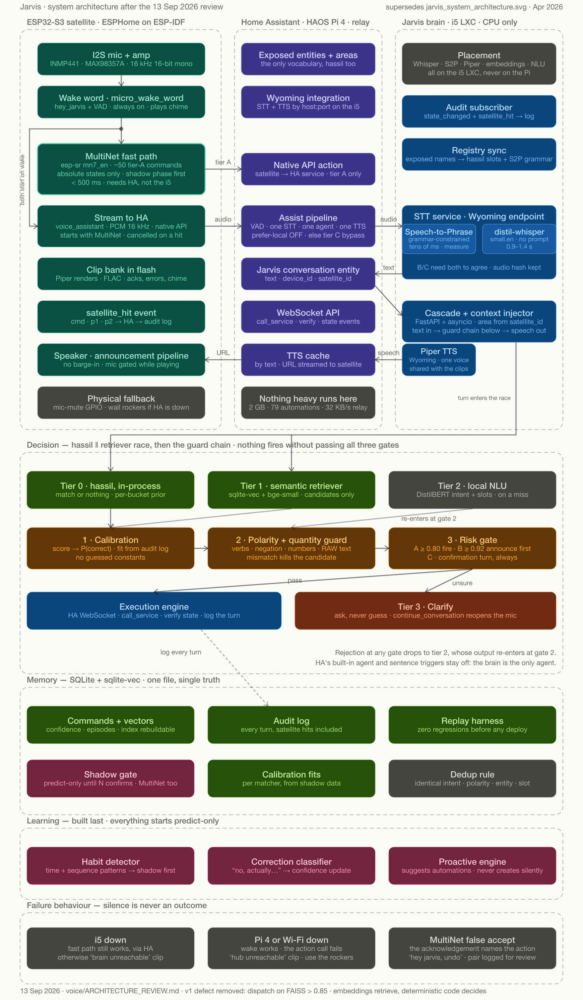

# Jarvis

An offline, correctness-first voice assistant for Home Assistant. An ESP32-S3 satellite
does the wake word and a small set of hot commands on-device; everything else is streamed
to a CPU-only brain on a Proxmox LXC. No cloud, no generative model in the action path.



This repository is a **scaffold**. The design is settled and written down; the code is
stubs with the interfaces, the guard rules and the data shapes in place. Nothing here
talks to real hardware yet. See [ARCHITECTURE_REVIEW.md](ARCHITECTURE_REVIEW.md) for the
reasoning behind every choice — section numbers in the source cite it directly.

## The rule everything else follows

> **Embeddings retrieve, deterministic code decides.**

The v1 design dispatched actions on `FAISS score > 0.85`. Sentence embeddings put
"turn on X" and "turn off X" at roughly 0.94 cosine, so that gate fires the wrong polarity
confidently and never escalates. Retrieval now only ever *proposes*. A candidate reaches
an action through the guard chain or not at all.

## Layout

| Path | Runs on | What it is |
|---|---|---|
| `satellite/` | ESP32-S3-DevKitC-1 N16R8 | ESPHome firmware. Wake word, MultiNet hot commands, audio streaming, clip playback |
| `ha-integration/` | HAOS Pi 4 | A conversation entity that forwards every turn to the brain. No model runs on the Pi |
| `brain/` | i5 LXC, CPU only | FastAPI. STT fan-out, hassil, retriever, calibration, guard chain, execution, memory, learning |
| `deploy/` | i5 LXC | Compose file for the Wyoming services and the brain |
| `docs/` | — | Build order and operational notes |

The satellite never talks to the brain directly. It talks to Home Assistant, and Home
Assistant talks to the brain — as its conversation agent and as its STT service.

## Request path

```
wake word ─┬─ MultiNet on-device ──── hit ───→ HA action + clip      (~0.5 s, tier A only)
           │                          miss ──↓
           └─ PCM stream → HA → brain STT → hassil / retriever → guards → execute → Piper
```

Tier A is lights and scenes: act and say what you did. Tier B is anything with a setpoint
or a consequence: announce first, act after a short window. Tier C is locks, gates, the
alarm: confirm out loud before acting, every time. The on-device table is tier A by
construction — the generator refuses to emit anything else.

## Status

Nothing is implemented. Every module raises `NotImplementedError` with a docstring naming
the section of the review it has to satisfy. Build order is in
[docs/BUILD_ORDER.md](docs/BUILD_ORDER.md); step 1 is a Stage A satellite against stock
Home Assistant, which is useful on its own and blocks on nothing.
